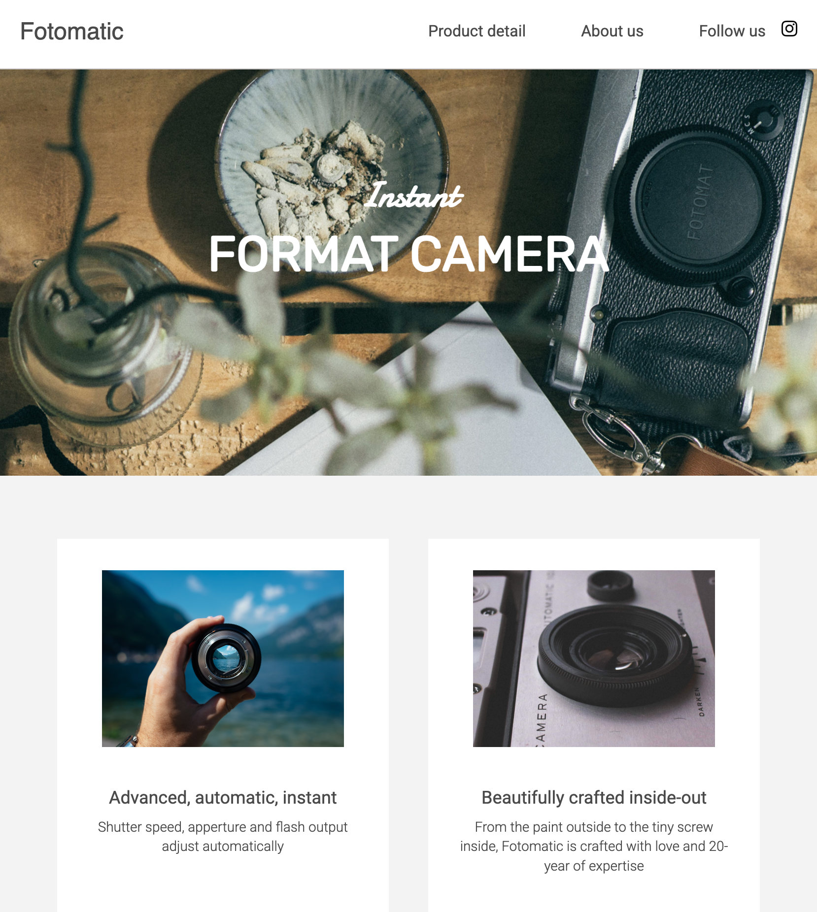
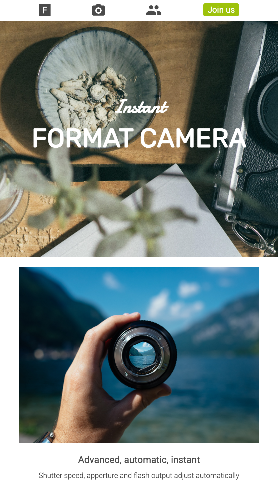

# Codecademy Fotomatic Project

## Table of contents
* [Project Goals](#project-goals)
* [Built with](#built-with)
* [How to use](#how-to-use)
* [Images](#images)

## Project Goals
In this project, you will fix a broken version of a responsive website called Fotomatic. Refer to the design [specs](https://static-assets.codecademy.com/Paths/full-stack-career-journey/Fotomatic/fotomatic_spec_landing_v3_.png?_gl=1*n0xoz0*_gcl_au*MTg0NTk1MzYyMi4xNzMzNTg5MzY4*_ga*ODQ3OTIwMTg4LjE3MzM1ODkzNzY.*_ga_3LRZM6TM9L*MTczODAxNDQzMy4zOS4xLjE3MzgwMTQ5MjkuMzcuMC4w) for more details.

This site works for: desktops, tablets, and mobile phones.

## Built with
* HTML
* CSS

## How to use
1. Clone the repository and change directory.

```bash
git clone https://github.com/trevoramaco/html-css.fotomatic.git
```

2. Open `html-css.fotomatic.git/index.html` file.

## Images

- Desktop:


- Tablet:



- Mobile:


